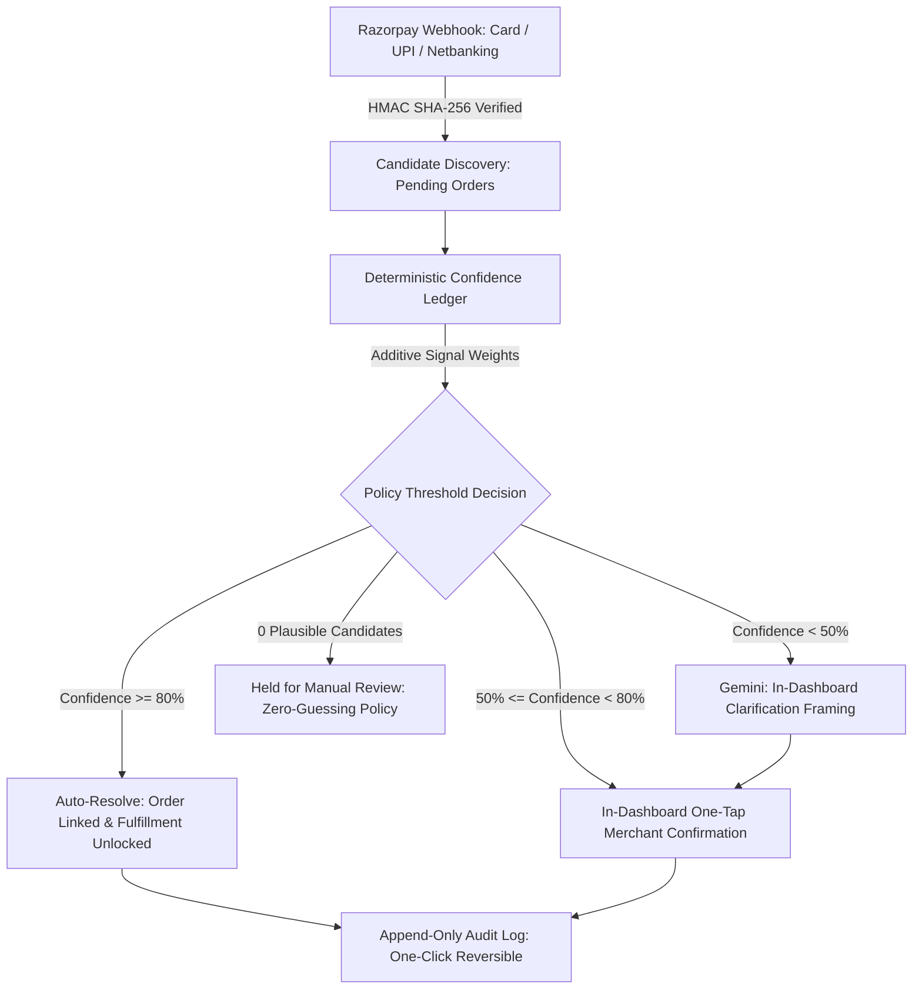

# Kisne Bheja

Razorpay tells a merchant money arrived. Kisne Bheja tells you what it was for.

## Track

Track 04: AI Finance Controller — closes a finance-ops matching loop by attributing ambiguous incoming payments to pending orders, reporting a measured match rate and an honest exception list.

## The Problem

When customers pay an Indian merchant through shared UPI IDs, static QR codes, or unlinked payment links, the payment gateway notifies the merchant that funds arrived but carries no order reference. When multiple customers purchase goods at the exact same price—such as two customers buying different ₹499 kurtas around the same time—the merchant has no deterministic way to tell which payment belongs to which customer. Guessing risks shipping the wrong product to the wrong customer or fulfilling an order twice. Without automated attribution, finance operations teams must halt fulfillment and manually cross-reference timestamps, bank logs, and customer chat messages.

## How It Works

1. A payment arrives via a verified Razorpay test-mode webhook carrying amount, gateway timestamps, and payer identity tokens (card last-4 and network, netbanking bank code, wallet provider, or UPI VPA hash).
2. The deterministic scoring engine evaluates all pending candidate orders across an additive Bayesian signal matrix (exact price match, exponential timing proximity, payer history proxy, payment link metadata, and merchant custom rules).
3. Configurable policy thresholds determine the resolution path: high-confidence matches (≥ 80%) auto-resolve immediately, middle-band matches (50%–79%) await one-tap merchant confirmation, and low-band ambiguous collisions (< 50%) receive a single bounded AI-assisted clarification framing inside the merchant dashboard.
4. Every resolution is recorded in an append-only, human-readable operational audit log and can be reversed with a single click if a mistake was made, instantly restoring the order to pending status and applying negative evidence against the incorrect pairing.

## Architecture



Incoming webhooks flow from Razorpay through HMAC verification, candidate pool discovery, deterministic Bayesian scoring, and policy threshold gating into auto-resolution, merchant confirmation, or manual review queues.

## Where AI Is Used, and Where It Deliberately Isn't

Google Gemini is used strictly for in-dashboard clarification framing: when two or more pending orders collide at the identical price and lack historical payer signals, Gemini analyzes the candidates and recent payment history to formulate one concise distinguishing question (under 35 words) and surfaces recent purchase patterns for the merchant.

Where AI is deliberately excluded:
- Gemini never sets the final match; all attribution is either decided by deterministic thresholds or explicitly confirmed by the merchant.
- Gemini never computes or alters confidence scores; all mathematical scoring is executed by pure TypeScript algorithms.
- Gemini never bypasses policy thresholds or automated safeguards.
- Exactly one clarification framing attempt is permitted per payment; if the merchant remains uncertain, the payment is routed to the manual review queue rather than prompting in an open-ended conversational loop.

## What Broke, and How It Was Fixed

During early benchmark testing across synthetic payment batches with large collision pools (e.g. 45 pending orders sharing the exact same ₹499 price point), the reconciliation engine slowed to a crawl, taking over 40 seconds per transaction and threatening an hour-long runtime for 100 payments.

Investigation revealed an O(N²) database query explosion inside `runMatchingEngine`: each time a signal was evaluated for a candidate order, `addEvidenceAndRecompute` was querying the entire evidence log from Supabase, inserting a single evidence row, and re-querying every candidate order in the database to recalculate rank. For a single payment evaluated against 45 candidates with 3 signals each, this triggered over 1,400 round-trip HTTP requests to Supabase across the public internet.

The fix was architectural: we introduced `appendEvidenceBatch` in `src/lib/repo.ts` to persist all evaluated signals across the candidate pool in a single bulk database insert, hoisted shared queries (such as active merchant rules) out of the candidate loop, and computed running confidence scores in memory. This reduced round-trip database queries from 1,440 down to 5 per transaction—a ~200x performance increase that brought benchmark execution down from over an hour to under 30 seconds while producing byte-for-byte identical confidence scores and audit logs.

## Results / Benchmark

Evaluated on a synthetic test set of 100 payments matched against 130 pending orders containing dense price collisions (₹499 apparel clusters, ₹1,499 linen shirts, and ₹349 retail items) with known ground-truth answers:

- **Total Test Transactions**: 100 payments (₹78,755.00 total volume)
- **Auto-Resolved (≥ 80% Confidence)**: 20 payments (20.0%) resolved autonomously without human touch
- **Merchant-Confirmed (50% – 79% Confidence)**: 54 payments (54.0%) confirmed via one-tap review in the dashboard
- **AI-Framed & Confirmed (< 50% Confidence)**: 21 payments (21.0%) resolved after in-dashboard Gemini clarification
- **Held for Manual Review (Zero-Guessing Safety)**: 5 payments (5.0%) safely held in review due to inconclusive evidence
- **False Auto-Links**: 0 (0.0% erroneous automated matches; zero false linkages tolerated)
- **Empirical Accuracy on Resolved Volume**: 100% of auto-resolved transactions matched the true ground-truth order
- **Median Resolution Latency**: 0.1 minutes (~6.0 seconds from webhook receipt to final settlement)

## Tech Stack

- **Framework**: Next.js 16 (App Router)
- **Language**: TypeScript 5
- **Database**: Supabase PostgreSQL
- **External APIs**: Razorpay API, Google Gemini API

## Running It Locally

```bash
# 1. Clone repository
git clone https://github.com/prathameshmore07/kisne-bheja.git
cd kisne-bheja

# 2. Install dependencies
npm install

# 3. Configure environment
cp .env.example .env.local
# Fill in NEXT_PUBLIC_SUPABASE_URL, NEXT_PUBLIC_SUPABASE_PUBLISHABLE_KEY,
# RAZORPAY_KEY_ID, RAZORPAY_KEY_SECRET, and GEMINI_API_KEY in .env.local

# 4. Seed database with pending orders
npm run seed

# 5. Start development server
npm run dev
```

Open [http://localhost:3000](http://localhost:3000) to view the landing page and [http://localhost:3000/dashboard](http://localhost:3000/dashboard) to view the live merchant ledger.

## Scope Boundaries

The boundaries of this prototype reflect deliberate product and engineering decisions:
- **No real money movement**: Operates exclusively in Razorpay test mode; it reconciles payment notifications without handling bank settlements or debit rails.
- **Single demo merchant**: Built as a dedicated finance controller for a single merchant store rather than a multi-tenant platform.
- **No multi-tenant authentication**: Omits merchant login walls, organizations, and role-based access control to keep the reconciliation flow and audit ledger immediately accessible for inspection.

---

Built by Prathamesh More
