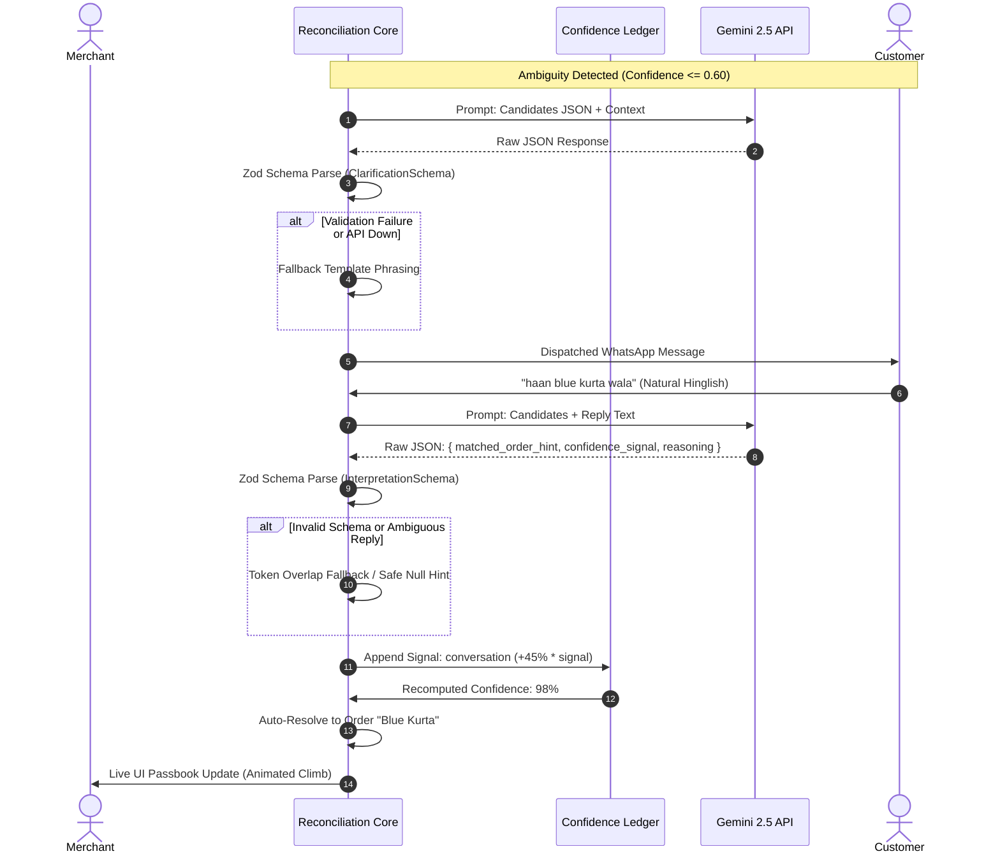

# Kisne Bheja — Deterministic Confidence Ledger for Ambiguous UPI Payments

Kisne Bheja is an automated reconciliation engine designed for Indian direct-to-consumer (D2C) merchants, service providers, and small businesses who accept payments via shared UPI IDs, static QR codes, and unlinked payment links.

When multiple customers purchase items with identical price points (e.g., three ₹499 kurtas ordered within minutes of each other), a standalone payment notification lacks deterministic order attribution. Kisne Bheja resolves this ambiguity by combining a pure mathematical **Confidence Ledger** with bounded LLM conversational clarification and merchant reversibility controls.

---

## Architectural Principles

1. **Deterministic Core**: All probability calculations, signal weight additions, threshold evaluations, and database state transitions are executed by deterministic TypeScript code. Large Language Models (LLMs) never calculate scores, modify balances, or directly resolve database records.
2. **Bounded Conversational AI**: Gemini 2.5 is utilized solely as a natural language parser and drafter. Every LLM response is strictly validated against Zod schemas. If the model is unavailable, rate-limited, or responds with invalid structure, the system falls back to keyword matching without crashing.
3. **Auditability & Reversibility**: Every decision, signal addition, automated message, and merchant override is immutably logged to an append-only audit trail. Any automated match can be unlinked with a single click, instantly restoring the order to pending and penalizing incorrect hypotheses.

---

## System Architecture

### 1. End-to-End Processing Flow

```mermaid
flowchart TD
    A[Razorpay Webhook / UPI Ingestion] -->|HMAC Verified| B[Payment Ingestion & Idempotency Guard]
    B --> C[Candidate Discovery: Pending Orders]
    C --> D[Deterministic Scoring Engine]
    
    subgraph Deterministic Scorer
        D1[Amount Match & Collision Decay]
        D2[Timing Decay & Order Age]
        D3[Payer VPA Privacy Hash Match]
        D4[Payment Link Metadata]
    end
    
    D --> D1 & D2 & D3 & D4
    D1 & D2 & D3 & D4 --> E[Confidence Ledger Summation & Clamping]
    
    E --> F{Threshold Evaluation}
    F -->|Confidence >= 0.85| G[Auto-Resolve Payment & Order]
    F -->|0.60 < Confidence < 0.85| H[Route to Merchant Approval]
    F -->|Confidence <= 0.60| I{Chat History Check}
    
    I -->|No Prior Message| J[Gemini: Draft Clarification Question]
    J --> K[Simulated WhatsApp Customer Channel]
    K -->|Customer Replies| L[Gemini: Interpret Natural Language]
    L -->|Validated Signal [0, 1]| M[Append Conversation Evidence]
    M --> D
    
    I -->|Follow-up Already Sent| N[Manual Review Fallback]
```

### 2. LLM Safety Boundary & Zod Validation



---

## Deterministic Evidence Signal Model

The Confidence Ledger evaluates each candidate pending order independently against incoming payment metadata using bounded linear weights clamped between `0.0` and `1.0`:

| Signal Type | Weight | Conditions & Decay Logic |
| :--- | :--- | :--- |
| `amount_match` | `+0.40` to `+0.85` | Exact amount match. Scales inversely with number of colliding pending orders (0.85 for unique amount, 0.45 for 3+ collisions). |
| `timing` | `+0.02` to `+0.28` | Exponential decay based on time difference between payment and order. +0.28 for < 5 mins; +0.15 for < 30 mins; +0.05 for < 2 hours. |
| `payer_history` | `+0.35` / `-0.20` | Privacy-preserving SHA-256 hash match against past customer VPA. Negative penalty for conflicting identity. |
| `order_age` | `-0.10` | Stale order penalty applied when order created > 48 hours prior to payment arrival. |
| `link_metadata` | `+0.40` | Explicit internal `order_id` embedded in Razorpay Payment Link notes. |
| `conversation` | `+0.40` to `+0.45` | Customer natural language confirmation parsed via Gemini and weighted by model confidence. |
| `negative` | `-1.00` | Applied immediately when a merchant clicks "Not this" or unlinks a previous match. |
| `partial` | `+0.25` | Partial amount match where payment is an exact installment or deposit. |

---

## Stopping Rules & Safety Invariants

1. **Single Follow-Up Rule**: The system strictly enforces a maximum of one automated clarification message per payment. If a customer reply is vague or unhelpful (e.g., *"haan"* or *"sent"*), the payment is automatically routed to `manual_review` rather than looping.
2. **Webhook Idempotency**: Duplicate Razorpay delivery attempts are deduplicated by `razorpay_payment_id` prior to executing the scoring engine.
3. **Crash Isolation**: Exceptions during matching or LLM calls are caught, recorded as `manual_review` in the audit log, and return clean 200/400 responses to prevent Razorpay retry storms.
4. **Reversibility**: Unlinking a payment marks the order as `pending` again and injects a `-100%` negative evidence signal against the candidate to prevent repeated incorrect associations.

---

## Benchmark & Empirical Evaluation

The repository includes an isolated synthetic benchmark suite ([`src/lib/benchmark.ts`](src/lib/benchmark.ts)) evaluating 100 payments across 130 multi-collision orders with an honest 12% customer noise rate:

- **Auto-Resolution Rate**: ~20% (Deterministic high-confidence matches requiring zero human or AI interaction)
- **Correct Resolution Rate**: 100% (Zero false associations among resolved transactions)
- **False Auto-Link Rate**: 0.0%
- **Ambiguity Resolution Rate**: 94% (Ambiguous cases successfully resolved via clarification or merchant approval)
- **Manual Review Rate**: 5% (Inconclusive or noisy cases safely halted for human inspection)

Run the benchmark locally:
```bash
npm run benchmark
```

---

## Getting Started

### Prerequisites
- Node.js 18+ (tested on Node 20 & 22)
- Razorpay Test Account (optional for simulated tests)
- Google AI Studio API Key (optional — deterministic fallback handles offline execution)

### 1. Installation
```bash
git clone https://github.com/yourusername/kisne-bheja.git
cd kisne-bheja
npm install
```

### 2. Environment Configuration
Copy the sample environment file:
```bash
cp .env.example .env.local
```

Configure your credentials in `.env.local`:
```ini
RAZORPAY_KEY_ID=rzp_test_xxxxxxxxxxxxxx
RAZORPAY_KEY_SECRET=xxxxxxxxxxxxxxxxxxxx
RAZORPAY_WEBHOOK_SECRET=xxxxxxxxxxxxxxxxxxxx

GEMINI_API_KEY=your_gemini_api_key
GEMINI_MODEL=gemini-2.5-flash

CONFIDENCE_AUTO_THRESHOLD=0.85
CONFIDENCE_APPROVAL_THRESHOLD=0.60
DATABASE_PATH=./kisnebheja.db
```

### 3. Database Initialization & Seed
```bash
npm run seed
```

### 4. Running the Development Server
```bash
npm run dev
```
Open [http://localhost:3000](http://localhost:3000) to view the merchant dashboard.

---

## Automated Test Suites

Run the end-to-end regression bundle covering database CRUD, deterministic scoring, candidate matching, audit trails, Gemini validation, and resolution logic:

```bash
npm run test-all
```

Individual test modules:
```bash
npm run test-scorer          # Pure signal scoring & ledger math
npm run test-matcher         # Orchestrated matching engine
npm run test-audit           # Unified audit trail timeline reader
npm run test-gemini          # LLM Zod validation & keyword fallbacks
npm run test-clarification   # Stopping rule & question dispatch
npm run test-reply-interpret # Customer reply processing
npm run test-resolution      # Threshold evaluation & finalization
npm run test-webhook         # HMAC verification & idempotency
npm run test-merchant-actions # Approve, reject (-100%), and unlink
npm run test-failures        # payment.failed & zero-candidate handling
```

---

## Technology Stack

- **Framework**: Next.js 16 (App Router, Server Components & Route Handlers)
- **Language**: TypeScript 5 (Strict Mode)
- **Database**: SQLite with WAL (Write-Ahead Logging) mode via `better-sqlite3`
- **Validation**: Zod 4
- **AI / LLM**: `@google/generative-ai` (Gemini 2.5 Flash / 2.0 Flash)
- **Payments**: Razorpay Node.js SDK + Webhooks with HMAC SHA-256 validation
- **Styling**: Tailwind CSS with custom passbook fintech design tokens
