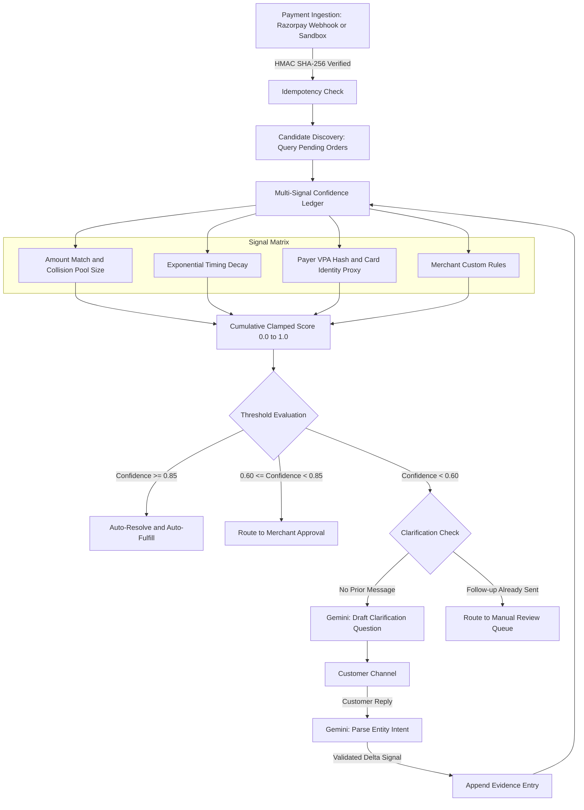
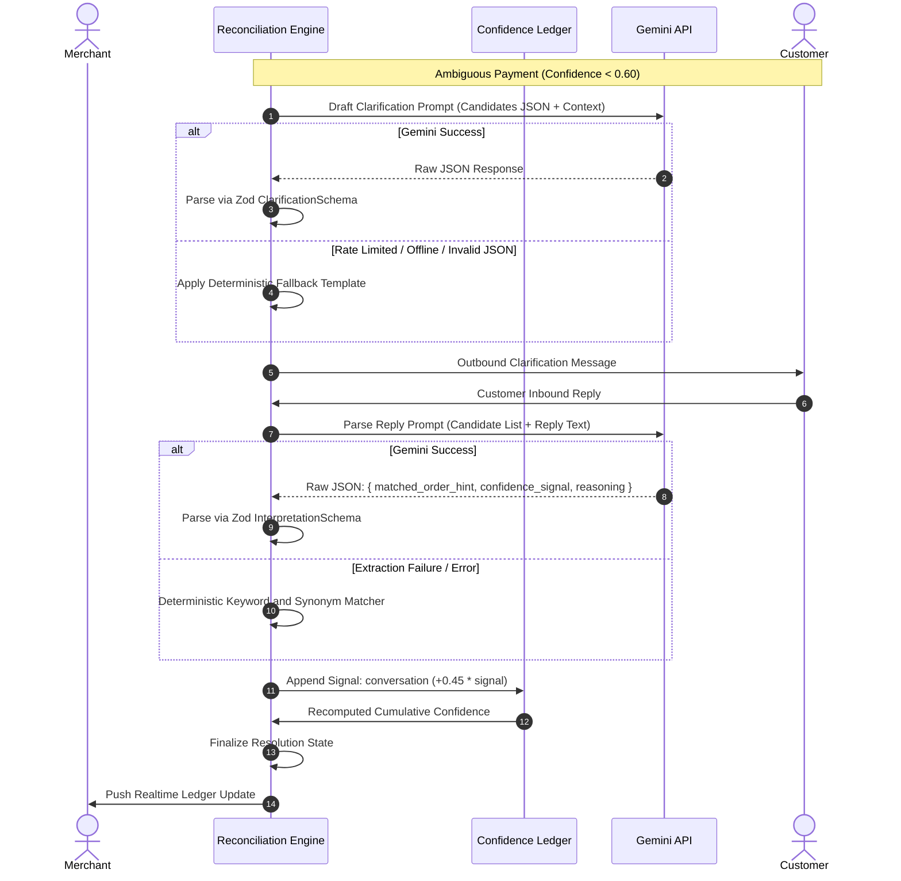
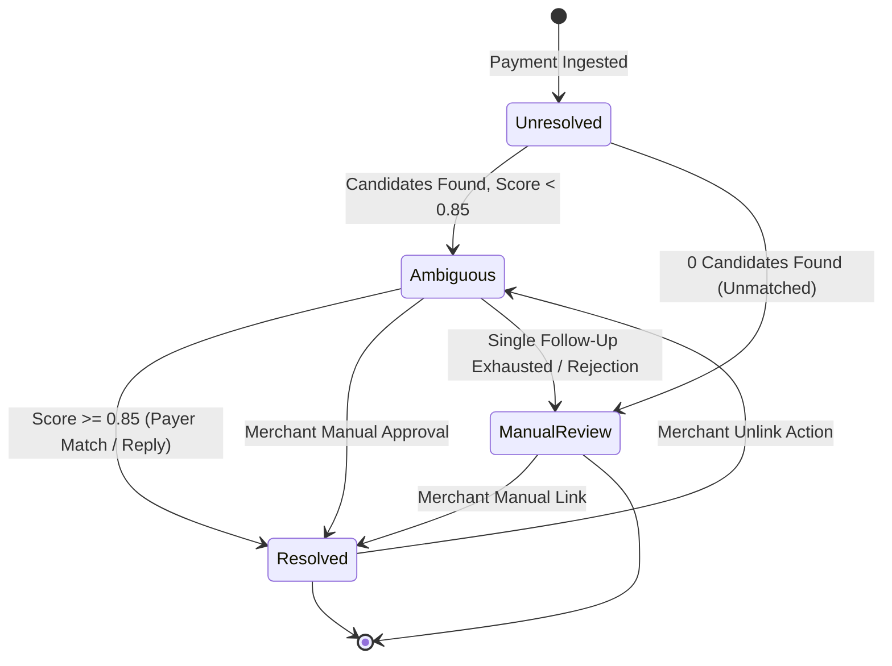
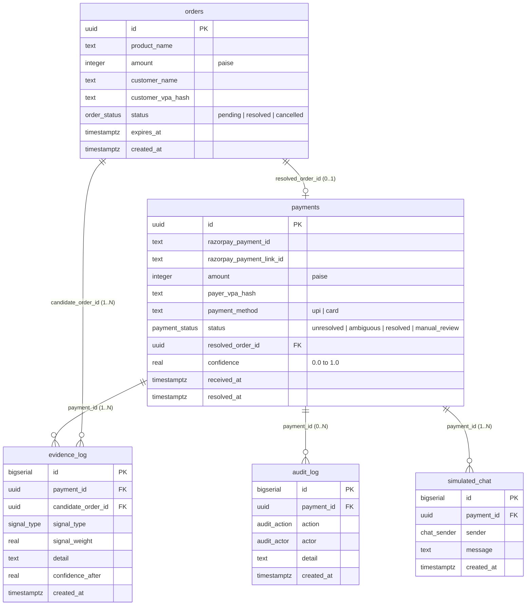

# Kisne Bheja — Deterministic Confidence Ledger for Ambiguous UPI Payments

Kisne Bheja is an automated payment reconciliation engine designed for Indian direct-to-consumer (D2C) merchants, service providers, and businesses that accept payments through shared UPI IDs, static QR codes, and unlinked payment links.

When multiple customers purchase items at identical price points (for example, multiple INR 499 orders placed in close succession), standalone banking webhooks lack deterministic order attribution. Kisne Bheja resolves this ambiguity by combining a deterministic mathematical Confidence Ledger with bounded conversational clarification and merchant override controls.

---

## Architectural Principles

1. **Deterministic Core**: All probability scoring, signal addition, threshold evaluation, and state transitions are executed by deterministic TypeScript code. Large Language Models (LLMs) never compute confidence scores or directly mutate database records.
2. **Bounded Conversational AI**: Google Gemini is used strictly for natural language drafting and customer reply extraction. Every LLM response is validated against strict Zod schemas. If the model is unavailable or rate-limited, deterministic keyword matching fallbacks take over seamlessly.
3. **Auditability and Reversibility**: Every decision, signal evaluation, automated message, and merchant override is logged in an append-only audit trail. Any match can be unlinked with a single click, restoring the order to pending status and applying negative evidence against incorrect hypotheses.
4. **Zero-Guessing Safety**: Payments that match zero pending orders or fail ambiguity thresholds are safely routed to manual review rather than assigned speculatively.

---

## System Architecture

### 1. Ingestion and Matching Pipeline



### 2. LLM Safety Boundary and Fallback Flow



### 3. Payment Resolution Lifecycle



---

## Deterministic Evidence Signal Model

The Confidence Ledger evaluates each candidate pending order independently against incoming transaction metadata using linear additive weights clamped between `0.0` and `1.0`:

| Signal Type | Weight Contribution | Mathematical Logic and Decay Curve |
| :--- | :--- | :--- |
| `amount_match` | `+0.40` to `+0.85` | Exact amount match. Scales inversely with the number of colliding pending orders ($0.85$ for unique amount, $0.45$ for 2 or more collisions). |
| `timing` | `+0.02` to `+0.28` | Exponential decay based on elapsed time between order creation and payment arrival ($+0.28$ for $< 5$ min; $+0.15$ for $< 30$ min; $+0.05$ for $< 2$ hours). |
| `payer_history` | `+0.35` | Privacy-preserving SHA-256 hash match against past customer VPA. |
| `card_proxy` | `+0.35` | Card Network + Last-4 digits proxy match against customer profile when VPA is absent. |
| `merchant_rule` | `+0.05` to `+0.30` | Merchant-defined conditional matching rule (customer name match, VPA match, product tag). |
| `conversation` | `+0.40` to `+0.45` | Customer reply confirmation parsed and validated via Zod schema, weighted by intent score. |
| `batch_assignment` | `+0.35` | Mutual exclusion boost from joint Hungarian bipartite assignment across multi-payment collision clusters. |
| `order_age` | `-0.10` | Stale order penalty applied when order creation exceeds 48 hours. |
| `negative` | `-1.00` | Hard disqualification applied when a candidate is explicitly rejected or unlinked. |

---

## Core Feature Specifications

### 1. Order Confidence Forecast
When an order is created, the system checks whether any other active pending order shares the exact same amount. If a collision exists, a real-time warning is presented to the merchant before saving.

### 2. Head-to-Head Candidate Comparison
When multiple competing orders exist within close score proximity, a side-by-side comparative evidence card displays signal-by-signal score differentials, allowing merchants to inspect exactly why one hypothesis is favored over another.

### 3. Merchant Custom Rules Engine
Merchants can configure rule predicates (such as customer name matching, VPA hash targeting, or product-specific loyalty bonuses) that automatically apply additive scoring weights during reconciliation.

### 4. Automated Order Expiry
Orders that remain unpaid beyond the merchant-configured threshold (default: 7 days) are transitioned to `cancelled` status to prevent stale collision clutter in the candidate search space.

### 5. Payment Velocity Anomaly Detection
The engine maintains a rolling 1-hour transaction monitor. If an unusual influx of identical-amount payments occurs within a short window (3 or more transactions), a Volume Spike flag is attached to the ledger entry.

### 6. Card Network and Last-4 Proxy Attribution
When payments originate from card networks rather than UPI VPAs, the engine extracts the Card Network (Visa, MasterCard, RuPay) and Last-4 digits, creating a deterministic identity proxy that functions identically to a VPA record.

### 7. Bijective Batch Assignment Pass
When two ambiguous payments sharing the same price arrive in the same time window, evaluating them independently risks greedy over-subscription to whichever order is marginally fresher. The engine executes a joint bipartite matching pass to uniquely resolve collision clusters simultaneously.

### 8. Performance Analytics and Reporting
The system computes week-over-week performance comparisons and real-time ledger metrics directly from Supabase, tracking resolution distributions without synthetic or ungrounded statistics.

---

## Database Schema



### Table Definitions

1. **`orders`**: Customer purchase records awaiting payment confirmation.
2. **`payments`**: Inbound transactions ingested from webhooks or simulation routes.
3. **`evidence_log`**: Immutable Confidence Ledger containing atomic signal additions and running score calculations.
4. **`audit_log`**: Append-only operational event stream tracking all system calculations and merchant actions.
5. **`simulated_chat`**: Outbound and inbound clarification messages.
6. **`merchant_rules`**: User-defined conditional scoring rules.

---

## Technical Stack

- **Framework**: Next.js 16 (App Router, React Server Components, Route Handlers)
- **Language**: TypeScript 5 (Strict Mode)
- **Database**: Supabase PostgreSQL with UUID primary keys, TIMESTAMPTZ, and custom enum mappings
- **Live Updates**: Supabase Realtime Channels (`postgres_changes` subscriptions)
- **Schema Validation**: Zod 4
- **AI Integration**: `@google/generative-ai` (Gemini 2.5 Flash / 2.0 Flash)
- **Payment Verification**: Razorpay SDK with HMAC SHA-256 constant-time verification
- **Styling**: Tailwind CSS with passbook fintech color system

---

## Getting Started

### Prerequisites

- Node.js 18 or higher (tested on Node 20 and Node 22)
- Supabase Project (free tier or local instance)
- Google Gemini API Key (optional; deterministic fallbacks handle offline execution)

### 1. Installation

```bash
git clone https://github.com/yourusername/kisne-bheja.git
cd kisne-bheja
npm install
```

### 2. Environment Configuration

Create a `.env.local` file in the root directory:

```ini
NEXT_PUBLIC_SUPABASE_URL=your_supabase_project_url
NEXT_PUBLIC_SUPABASE_ANON_KEY=your_supabase_anon_key
SUPABASE_SERVICE_ROLE_KEY=your_supabase_service_role_key

RAZORPAY_KEY_ID=your_razorpay_key_id
RAZORPAY_KEY_SECRET=your_razorpay_key_secret
RAZORPAY_WEBHOOK_SECRET=your_razorpay_webhook_secret

GEMINI_API_KEY=your_gemini_api_key
GEMINI_MODEL=gemini-2.5-flash

CONFIDENCE_AUTO_THRESHOLD=0.85
CONFIDENCE_APPROVAL_THRESHOLD=0.60
```

### 3. Database Initialization

Execute the SQL schema in [`supabase/schema.sql`](supabase/schema.sql) within your Supabase SQL Editor, then seed initial records:

```bash
npm run seed
```

### 4. Running Development Server

```bash
npm run dev
```

Open [http://localhost:3000](http://localhost:3000) to view the merchant dashboard.

---

## Automated Test Suites

The codebase includes end-to-end regression test suites covering database CRUD, deterministic scoring, orchestrated matching, audit logging, Gemini fallback parsing, and batch resolution:

```bash
npm run test-all          # Executes all 9 test suites sequentially with database resets
npm run test-new-features # Verifies all 7 advanced reconciliation features
```

### Individual Test Commands

```bash
npm run test-repo          # Database queries, mappings, and state mutations
npm run test-scorer        # Pure signal scoring and mathematical bounds
npm run test-matcher       # Orchestrated multi-candidate resolution engine
npm run test-audit         # Unified audit trail timeline reader
npm run test-gemini        # LLM Zod validation and keyword fallbacks
npm run test-clarification # Stopping rules and single follow-up enforcement
npm run test-reply-interpret # Natural language reply processing
npm run test-resolution    # Threshold evaluation and auto-fulfillment
npm run test-webhook       # HMAC verification and idempotency deduplication
npm run test-merchant-actions # Approve, reject (-100%), and unlink workflows
npm run test-failures      # Gateway failure and zero-candidate error paths
npm run test-batch-resolver # Joint Hungarian bipartite matching
```

---

## License

MIT License. See `LICENSE` for details.

---

Built by Prathamesh More
