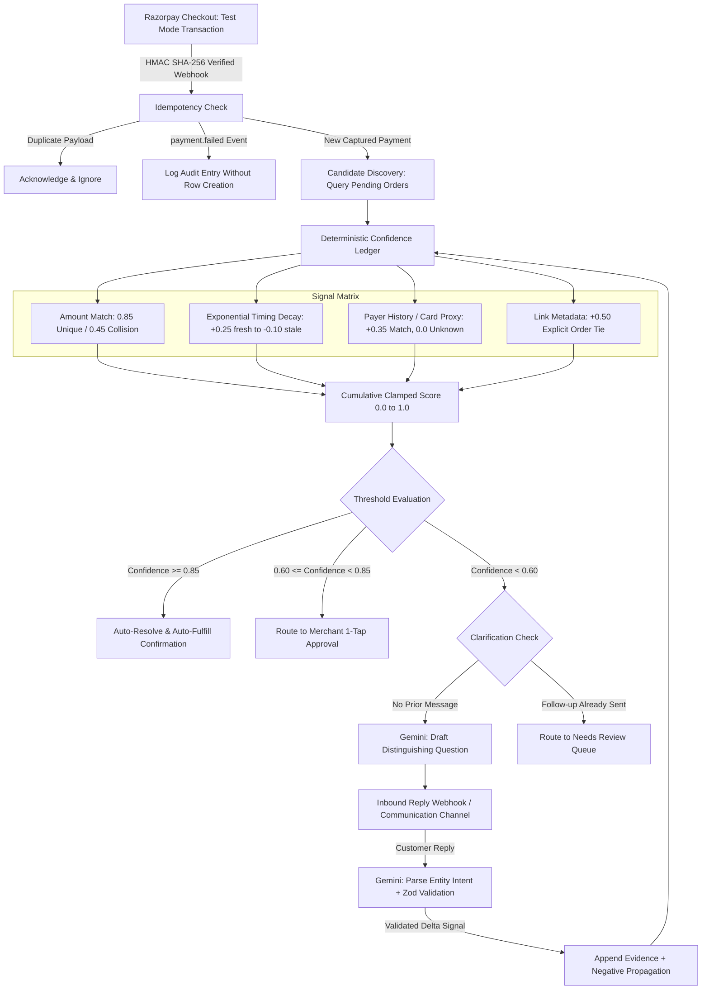
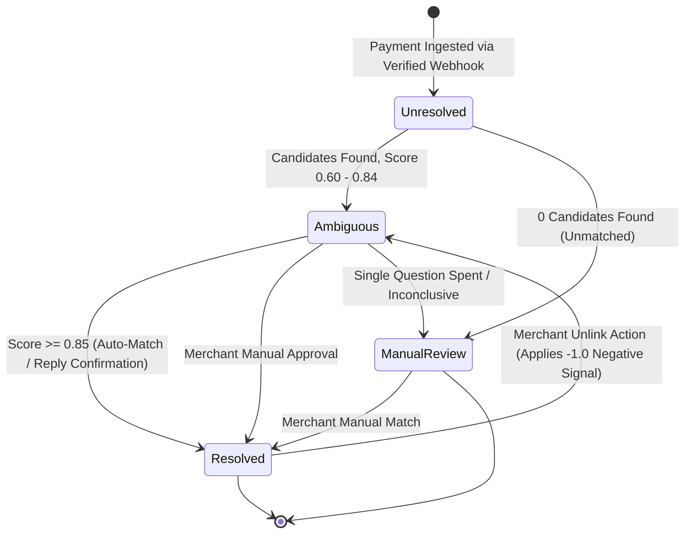

# Kisne Bheja — Deterministic Payment Identity Resolution

Kisne Bheja (*"Who sent this payment?"*) is an automated payment reconciliation engine designed for Indian direct-to-consumer (D2C) merchants, service providers, and businesses that accept payments through shared UPI IDs, static QR codes, and unlinked payment links.

When multiple customers purchase items at identical price points (for example, multiple ₹499 orders placed in close succession), standalone banking webhooks lack deterministic order attribution. Kisne Bheja resolves this ambiguity by combining a deterministic mathematical Confidence Ledger with bounded conversational clarification and merchant override controls.

---

## Core Non-Negotiable Invariants

1. **Razorpay Test-Mode is the Only Entry Point**: Every payment record must genuinely originate from a real Razorpay test-mode transaction and be verified through Razorpay's HMAC SHA-256 webhook signature. No bypass endpoint, mock creation script, or direct insert button exists in the production application.
2. **Deterministic Core (No AI in Scoring or Decisions)**: All probability scoring, timing decay, signal addition, threshold evaluation, and state transitions are executed by deterministic TypeScript algorithms. Large Language Models (LLMs) never compute confidence scores or directly mutate database records.
3. **No Unfair Penalty for New Payers**: Absence of a known customer history is never penalized. Only a positive match to a specific different known customer counts as negative evidence.
4. **Joint Collision Assignment**: When multiple ambiguous payments of the same amount are pending simultaneously, they are solved jointly via greedy maximum-weight bipartite assignment so two payments can never claim the same order.
5. **Bounded, Schema-Validated Gemini AI**: Google Gemini is used strictly for three bounded tasks: drafting one short clarifying question without mentioning the amount, extracting structured intent from customer replies, and explaining evidence. Every LLM response is validated against strict Zod schemas and cross-checked against actual candidate orders. Fallback executions are explicitly logged.
6. **Auditability and 1-Click Reversibility**: Every action is written to a single, append-only, plain-language audit trail per payment. Any match can be unlinked with a single click, restoring the order to pending status and applying negative evidence ($-1.0$) against the incorrect pairing.
7. **Zero-Guessing Safety**: Payments that match zero pending orders are safely routed to Needs Review rather than assigned speculatively.

---

## System Architecture

### 1. Ingestion and Matching Pipeline



### 2. Payment Resolution Lifecycle



---

## Deterministic Evidence Signal Model

The Confidence Ledger evaluates each candidate pending order independently against incoming transaction metadata using linear additive weights clamped between `0.0` and `1.0`:

| Signal Type | Weight Contribution | Mathematical Logic and Policy |
| :--- | :--- | :--- |
| `amount_match` | `+0.45` to `+0.85` | Exact amount match. Scales inversely with collision count ($+0.85$ for unique amount, $+0.45$ for 2 or more collisions). |
| `timing` | `+0.02` to `+0.25` | Exponential decay based on elapsed time between order creation and payment arrival ($+0.25$ for $< 5$ min; $+0.15$ for $< 15$ min; $+0.05$ for $< 1$ hour). |
| `payer_history` | `+0.35` | Privacy-preserving SHA-256 hash match against past customer VPA. Absence of history carries $0.0$ neutral weight (never penalized). |
| `card_proxy` | `+0.35` | Card Network + Last-4 digits proxy match against customer profile when VPA is absent. |
| `link_metadata` | `+0.50` | Explicit order ID embedded in Razorpay payment link notes. |
| `merchant_rule` | `+0.05` to `+0.30` | Merchant-defined conditional matching rule (customer name match, VPA match, product tag). |
| `conversation` | `+0.40` to `+0.45` | Customer reply confirmation parsed and validated via Zod schema, weighted by intent score. |
| `batch_assignment` | `+0.35` | Mutual exclusion boost from joint Hungarian bipartite assignment across multi-payment collision clusters. |
| `order_age` | `-0.10` | Stale order penalty applied when order creation exceeds 48 hours. |
| `negative` | `-1.00` | Hard disqualification applied when a candidate is explicitly rejected or unlinked. |

---

## Live Demo Guide (End-to-End Real Flow)

To demonstrate the full payment resolution pipeline live using genuine Razorpay test-mode transactions:

### Step 1: Initialize Pending Orders
Ensure the product catalog has realistic pending orders (e.g. Blue Kurta ₹499, Red Kurta ₹499, Yoga Mat ₹799):
```bash
npm run seed
```

### Step 2: Start Development Server
```bash
npm run dev
```
Open [http://localhost:3000/dashboard](http://localhost:3000/dashboard) to view the merchant dashboard.

### Step 3: Create a Real Razorpay Payment Link
- **Option A (UI)**: Click **"Test Payment (Razorpay)"** in the top navigation -> Select the ₹499 2-Way Collision preset -> Click **"Generate Razorpay Link"**.
- **Option B (CLI)**: Run:
  ```bash
  npm run create-link 499 "Kurta Collision Live Demo"
  ```

### Step 4: Complete Payment in Razorpay Test Mode
1. Click **"Open Checkout"** to navigate to the live Razorpay test-mode checkout page (`https://rzp.io/i/...`).
2. Enter standard Razorpay test credentials:
   - **Test UPI**: `success@razorpay` (or select any UPI simulator option).
   - **Test Card**: `4111 2222 3333 4444` (Expiry: `12/28`, CVV: `123`).
3. Complete the payment.

### Step 5: Observe Live Reconciliation
1. Razorpay dispatches the verified webhook to `/api/webhook`.
2. The HMAC signature is verified against `RAZORPAY_WEBHOOK_SECRET`.
3. The payment row appears in the ledger in real time, evaluated across the multi-signal Confidence Ledger.
4. For the ₹499 collision, observe Gemini draft a single clarifying question, receive customer confirmation, propagate negative evidence to competing items, and auto-resolve the transaction.

---

## Technical Stack

- **Framework**: Next.js 16 (App Router, React Server Components, Route Handlers)
- **Language**: TypeScript 5 (Strict Mode)
- **Database**: Supabase PostgreSQL with UUID primary keys, TIMESTAMPTZ, and native custom enums
- **Live Updates**: Supabase Realtime Channels (`postgres_changes` subscriptions)
- **Schema Validation**: Zod 4
- **AI Integration**: `@google/generative-ai` (Gemini 2.5 Flash / 2.0 Flash)
- **Payment Verification**: Razorpay SDK with constant-time HMAC SHA-256 verification
- **Design System**: Tailored light and dark palettes with hairline dividers and exactly 3 status colors (Uncertain: Amber, Resolved: Emerald, Needs Attention: Crimson)

---

## Automated Test Suites

Every test script is self-contained and resets its own database state at start, producing identical results whether executed alone or in a batch suite:

```bash
npm run test-all          # Executes all 9 test suites sequentially
npm run test-new-features # Verifies advanced extension features
npm run benchmark         # Runs 100-payment synthetic benchmark and outputs raw JSON
```

### Individual Test Commands

```bash
npm run test-repo          # Database queries, mappings, and state mutations
npm run test-scorer        # Pure signal scoring and mathematical bounds
npm run test-matcher       # Orchestrated multi-candidate resolution engine
npm run test-audit         # Plain-language operational audit trail
npm run test-gemini        # LLM Zod validation and keyword fallbacks
npm run test-clarification # Single question stopping rule enforcement
npm run test-reply-interpret # Natural language reply processing and negative propagation
npm run test-resolution    # Threshold evaluation and auto-fulfillment
npm run test-webhook       # HMAC verification and idempotency deduplication
npm run test-merchant-actions # Approve, reject (-100%), and unlink workflows
npm run test-failures      # Gateway failure and zero-candidate error paths
npm run test-batch-resolver # Joint Hungarian bipartite matching
```

---

## License

MIT License. See `LICENSE` for details. Built by Prathamesh More.
